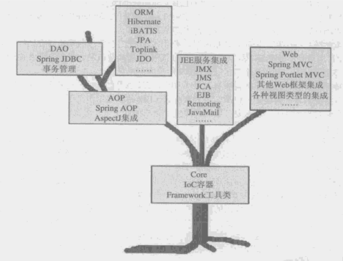

## Spring框架概述

&emsp;&emsp;从广义上讲，不管Spring框架自发布到现在经历了多少次版本更迭（从1.x到现在5.1），其本质始终是不变的，都是为了提供各种服务，以帮助我们简化基于POJO的Java应用程序开发。其实Spring就是一个大Factory，用于管理Bean并提供各种服务。

&emsp;&emsp;组成Spring框架的各种服务实现被划分到多个相互独立却又相互依赖的模块当中，整个框架构建在Core核心模块之上。在该模块中，Spring为我们提供了一个IOC容器
（IoC Container）实现，用于帮助我们以依赖注入的方式管理对象之间的依赖关系，除此之外Core核心模块中还包括框架内部使用的各种工具类，比如Spring基础IO工具类等。
 

&emsp;&emsp;向左遍历来到AOP模块，该模块提供了一个轻量但功能强大的AOP框架，让我们以AOP的形式增强POJO的能力，进而弥补OOP/OOSD的缺憾。Spring AOP采用的是
Proxy模式构建，与IoC容器相结合，可以充分显示出Spring AOP的强大威力。
 

&emsp;&emsp;继续向上，在Core核心模块和AOP模块基础上，为我们提供了完备的数据库访问和事务管理的抽象和集成服务。在数据访问支持方面，Spring多JDBC API的最佳
实践极大简化了该API的使用。除此之外，Spring框架为各种当前业界流行的ORM产品，比如：Hibernate、Mybatis、Toplink、JPA等提供了形式统一的集成支持。Spring框架的
事务管理抽象层是Spring AOP的最佳实践，它直接构建在Spring AOP基础之上的，为我们提供编程式事务管理和声明式事务管理的完备支持。这些服务极大地简化了日常应用开发过程
中的数据访问和事务管理工作。
  
 
&emsp;&emsp;为了简化各种Java EE服务（JNDI、JMS及JavaMail等）的使用，Spring框架为我们提供了针对这些Java EE服务的集成服务。在Spring帮助下，这些Java EE服务
都变得不再繁琐难用。随着航天科技的发展，我们在地球可以发送飞船去访问其它星球，使用Spring框架构建的基于POJO应用的程序也需要访问一些公开服务的话，Spring的Remoting
框架将帮助完成这一使命。
 

&emsp;&emsp;最后提到的就是Web模块，在该模块中，Spring框架提供了一套自己的Web MVC框架，Spring的Portlet MVC构建在Spring Web MVC之上。Spring Web MVC并不
排斥现有的其它Web框架，像Struts、WebWork等；Spring的Web框架都为他们提供了集成支持，除此之外，像Web开发中可能牵扯的各种视图（View）技术，Spring Web框架更是给予了
足够的重视。
 

&emsp;&emsp;就像一棵树一样，必须依赖强大的根基才能枝叶茂盛，Spring各个模块也是如此。理论上，Spring中的上层模块依赖于下层模块才能正常工作，而同一水平线上的各个模块可以
认为是相互独立的。
 

&emsp;&emsp;注意：不要只将Spring看做是一个Ioc容器，也不要只将Spring与AOP挂钩，Spring提供的远比此要多，Spring不仅仅是一个简化了Java EE开发的轻量级框架，更应该是一个
简化了任何Java应用的开发框架。如果你愿意，甚至可以在Java的三大平台上（J2SE、J2EE、J2ME）应用Spring框架。