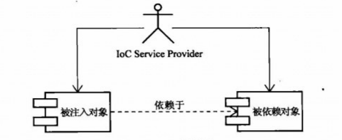

## IOC

&emsp;&emsp;Spring的IoC容器是整个Spring框架的核心和基础。Spring为什么要提供这样一个容器呢？即使是提供了这样一个容器，为什么要以IoC冠名呢？
 

### 理念：让别人为你服务

&emsp;&emsp;IoC是近年来轻量级容器（Lightweight Container）的兴起而逐渐被许多人提起的名词，它的全称是Inversion of Control（控制反转），
它还有个别名是依赖注入（Dependency Injection），”反转“是用来形容IoC容器最多的一句话。那么为什么需要IoC？它的意义是什么？有什么独到之处？此处
将IoC和依赖注入等同看待，但在有的书籍中是将依赖注入看做是IoC的一种方式。
 

&emsp;&emsp;下面以ioc的项目案例来详细讲解 eg:com.redlips.spring.features.ioc
    
    /**
     * 假设默认使用（道琼斯新闻社）的新闻，我们需要提供上面两个接口的实现类，通常需要在构造函数中构造FXNewsProvider依赖的这两个类，这种被依赖
     * 的类、或对象，简称为“依赖类”、“依赖对象”。
     * 下面是构造道琼斯的两个依赖类
     */
    public FXNewsProvider() {
        newsListener = new DowJonesNewsListener();
        newsPersistent = new DowJonesNewsPersistent();
    }

&emsp;&emsp;这就是我们通常做事的方式，如果依赖于某个类或服务，最简单而有效的方式就是直接在类的构造函数中构造依赖的类。就像我们要装修房子，需要用
家具，这时可以用我们通常的做法：直接打造出家具。不过，我们也可以直接去家具城买回来，然后再进行布置。
 
&emsp;&emsp;不管是直接打造家具（通过new构造对象），还是去家具城买家具（或许是通过Service-Locator解决直接的耦合关系），有一个共同点就是都是自
己主动去获取依赖的对象。Service-Locator是J2EE核心模式的一种，主要通过引入中间代理者消除对象间复杂的耦合关系，并统一管理分散的复杂耦合关系。
 
&emsp;&emsp;回头想想，每次用到依赖对象就主动去获取，真的有这个必要吗？我们最终所做的就是直接用到依赖对象所提供的服务而已。只要用到这个对象的时候
，它能够准备就绪，我们完全可以不管这个对象是自己找来的还是别人送来的。对于FXNewsProvider来说，就是在getAndPersistNews()方法调用newsListener
的相应方法时，newsListener能够准备就绪就行。如果有人能够将我们需要的某个依赖对象送过来，就没必要大费周折自己去折腾了。
 
&emsp;&emsp;实际上，IoC就是为了帮助我们避免之前的大费周折，而提供的更加轻松简洁的方式。它的反转就是从原来的‘事必躬亲’到现在‘享受服务’，IoC的理念就是
让别人为你服务，也就是让IoC Service Provider来为你服务。

