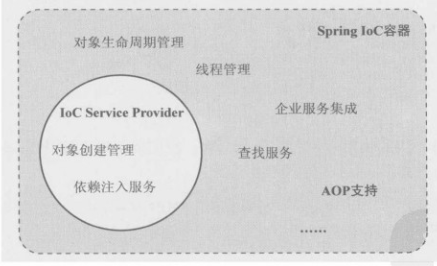
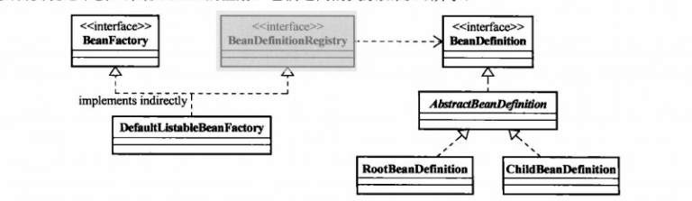

## IoC容器之BeanFactory
&emsp;&emsp;Spring的IoC容器是一个IoC Service Provider，但是，这只是它被冠以IoC之名的部分原因，我们不能忽略的是“容器”。Spring的IoC容器是
一个提供了IoC支持的轻量级容器，除了基本的IoC支持，它作为轻量级容器还提供了IoC之外的支持。如在Spring的IoC容器之上，Spring还提供了相应的AOP框架
支持、企业级服务集成等服务。Spring的IoC容器和IoC Service Provider所提供的服务存在一定的交集。
<br>


&emsp;&emsp;提供了两种容器类型：BeanFactory和ApplicationContext.
<br>
- BeanFactory：基础类型IoC容器，提供完整的IoC服务支持。如果没有特殊指定，默认使用延迟初始化策略(lazy-load)。只有客户端对象在需要访问某个受管
对象的时候，才对该对象进行初始化以及依赖注入操作。所以，相对来说，容器启动初期速度较快，所需的资源也有限。

- ApplicationContext：ApplicationContext是在BeanFactory的基础上构建，是相对比较高级的容器实现。除了拥有BeanFactory的所有支持，它还提供
了其它高级的特性，比如事件发布、国际化信息支持等。ApplicationContext所管理的对象，在该类型容器启动之后，默认全部初始化并绑定完成。所以，相对于
BeanFactory来说，ApplicationContext要求更多的系统资源，启动时长相对要比BeanFactory要长一些。二者的关系图：


&emsp;&emsp;在新版中，ApplicationContext还继承EnvironmentCapable接口，ApplicationContext间接继承自BeanFactory，所以说它是构建于BeanFactory
之上的IoC容器。
<br>
&emsp;&emsp;BeanFactory，顾名思义，就是生产Bean的工厂。既然Spring框架提倡使用POJO，那么把每个业务对象看做一个JavaBean对象，或许更容易理解
为什么Spring的IoC容器会起这么一个名字。作为Spring提供基本的IoC容器，BeanFactory可以完成作为IoC Service Provider的所有职责，包括业务对象
注册和对象间的依赖绑定。
<br>
&emsp;&emsp;将应用所需的所有业务对象交给BeanFactory之后，剩下要做的就是直接从BeanFactory取得最终组装完成并且可用的对象。至于业务对象如何组装
，你不需要关心，BeanFactory可以帮你搞定。所以，对于客户端而言，与BeanFactory打交道其实很简单。最基本地，BeanFactory肯定会公开一些取得组装完成
的对象方法接口。对于独立的应用程序，这些主入口是和容器API直接耦合的
<br>

### 使用BeanFactory后的改观

&emsp;&emsp;确切的说，拥有BeanFactory之后，对于系统的设计和业务逻辑的处理并没有什么影响。而唯一的不同就是对象间依赖关系的解决方式改变了。现在需要
什么对象，直接让BeanFactory提供就可以了。所以简单点说，拥有BeanFactory之后，要使用IoC设计模式进行系统业务对象的开发。（实际上，即使不使用BeanFactory
之类的轻量级容器支持开发，开发中也尽量使用IoC模式）
<br>
&emsp;&emsp;拥有BeanFactory之后，对象的创建和对象间依赖关系的绑定都由BeanFactory来完成。但是如何做，还是需要通过某种方式来告诉它，例如通过XML
文件来注册并管理对象间的依赖关系。
    
    <beans>
        <bean id="djNewsProvider" calss="...FXNewsProvider">
            <constructor-arg index="0">
                <ref bean="djNewsListener"/>
            </constructor-arg>
            <constructor-arg index="1">
                <ref bean="djNewsPersistent"/>
            </constructor-arg>
        </bean>
        ...
    </beans>

&emsp;&emsp;在使用FXNewsProvider的时候，之前我们需要自己new出来，但是现在只需要将生产图纸(XML文件)交给BeanFactory，让BeanFactory生产一个即可
    
    DefaultListableBeanFactory factory = new DefaultListableBeanFactory();//构造工厂
    XmlBeanDefinitionReader reader = new XmlBeanDefinitionReader(factory);//新增Xml阅读器
    reader.loadBeanDefinitions(new ClassPathResource("配置文件路径"));//规则注册入容器
    FXNewsProvider newsProvider = (FXNewsProvider)factory.getBean("djNewsProvider");
    
    或者
    
    ApplicationContext container = new ClassPathXmlApplicationContext("配置文件路径");
    FXNewsProvider newsProvider = (FXNewsProvider)container.getBean("djNewsProvider");

### BeanFactory的对象注册和依赖绑定方式

&emsp;&emsp;BeanFactory作为一个IoC Service Provider，为了明确管理各个业务对象以及业务对象间的依赖绑定关系，同样需要某种途径需要记录和管理
这些信息。而BeanFactory支持常用的三种方式。
- 直接编码方式：其实，把编码方式单独作为一种方式并不十分恰当，因为无论何种方式，最终都需要编码才能落实。不过通过这些编码可以让我们更加清楚BeanFactory
在底层是如何运作的。
```    
public static void main(String[] args) {
    DefaultListableBeanFactory beanRegistry = new DefaultListableBeanFactory();//构造工厂
    BeanFactory container = bindViaCode(beanRegistry);
    FXNewsProvider newsProvider = (FXNewsProvider) container.getBean("djNewsProvider");
    newsProvider.getAndPersistNews();
}
public static BeanFactory bindViaCode(BeanDefinitionRegistry  registry) {
    AbstractBeanDefinition newsProvider = new RootBeanDefinition(FXNewsProvider.class);
    AbstractBeanDefinition newsListener = new RootBeanDefinition(DowJonesNewsListener.class);
    AbstractBeanDefinition newsPersistent = new RootBeanDefinition(DowJonesNewsPersistent.class);

    // 将Bean定义注册到容器中
    registry.registerBeanDefinition("djNewsProvider", newsProvider);
    registry.registerBeanDefinition("djNewsListener", newsListener);
    registry.registerBeanDefinition("djNewsPersistent", newsPersistent);

    // 指定依赖关系
    // 1.通过构造方法注入方式
    ConstructorArgumentValues argumentValues = new ConstructorArgumentValues();
    argumentValues.addIndexedArgumentValue(0, newsListener);
    argumentValues.addIndexedArgumentValue(1, newsPersistent);
    newsProvider.setConstructorArgumentValues(argumentValues);
    // 2.或者通过setter方法注入方式
    MutablePropertyValues propertyValues = new MutablePropertyValues();
    propertyValues.addPropertyValue(new PropertyValue("newsListener", newsListener));
    propertyValues.addPropertyValue(new PropertyValue("newsPersistent", newsPersistent));
    newsProvider.setPropertyValues(propertyValues);

    // 绑定完成
    return (BeanFactory) registry;
}
```
&emsp;&emsp;BeanFactory只是一个接口，我们最终需要该接口的实现类进行实际的Bean管理，DefaultListableBeanFactory就是一个比较通用的BeanFactory
实现类。它是间接地实现了BeanFactory接口，还实现了BeanDefinitionRegistry接口，该接口才是在BeanFactory的实现中担当Bean的注册和管理的角色。
基本上BeanFactory只定义了如何访问容器内部Bean的方法，而它的具体实现类负责具体的Bean注册及管理的工作。BeanDefinitionRegistry接口抽象了Bean
的注册逻辑。通常，只有具体的BeanFactory实现类才实现这个接口来管理Bean。
<br>

<br>
&emsp;&emsp;注意：最后一行的强制转换是在特定场景的，因为DefaultListableBeanFactory同时实现了BeanFactory和BeanDefinitionRegistry接口
所以，强制转换是不会出现问题。单纯的BeanDefinitionRegistry是无法强制转换到BeanFactory类型的。

- 外部配置文件方式<br>
&emsp;&emsp;Spring的IoC容器支持两种配置文件格式properties文件格式、XML文件格式。当然也可以引入自己的格式。<br>
&emsp;&emsp;采用外部文件时，Spring的IoC容器有一个统一的处理方式。通常情况下，需要根据不同的外部文件